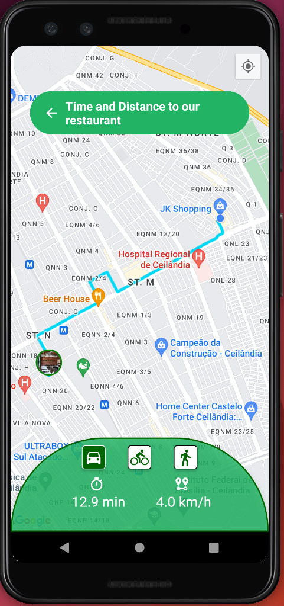

# 📍 Restaurant Location

     &nbsp;&nbsp;&nbsp;&nbsp;&nbsp;&nbsp;&nbsp;&nbsp;&nbsp;&nbsp;&nbsp;&nbsp;&nbsp;&nbsp;&nbsp;&nbsp;&nbsp;&nbsp;&nbsp;&nbsp;&nbsp;&nbsp;&nbsp;&nbsp;&nbsp;&nbsp;&nbsp;&nbsp;&nbsp;
     

<h3 id="acessar-projeto">📁 Inicialização da Clonagem</h3>

◽ Clonar o repositório ultilizando Git Bash + o comando:

       $ git clone https://github.com/IMatheusPiresI/rn-restaurant-location.git

◽ Instalar as dependências utilizando o comando:  

        $ yarn

◽ Após a instalação das dependências, rodar o comando   

        $ yarn run android

##  TECHNOLOGIES

<ul>
  <li>
    
React Native CLI

  </li>
  <li>
    
TypeScript

  </li>
  <li>
    
Styled-Components

  </li>
  <li>
    
Geolocalização

  </li>
  <li>
    
react-native-maps

  </li>
   <li>
    
react-native-maps-directions

  </li>
  <li>
    
react-native-responsive-fontsize

  </li>

</ul>

<h3 id="sobre">📍 Sobre</h3>

✅ Desenvolvido com React Native CLI, TypeScript, Geolocalização e mapas no react-native.  
✅ Exibe a Distância, o tempo e a rota até o restaurante a partir da localização atual do usuário. 
✅ Utilizado react-native-maps e directions e para exibir o mapa com API go google mapas e as rotas tracejadas. 
✅ Estilizações criadas utilizando Styled-Components 

<h3 id="autor">✒️ Autor</h3>

[Clique aqui](https://matheuspires.vercel.app)🔗 e acesse meu portfólio!  

  
